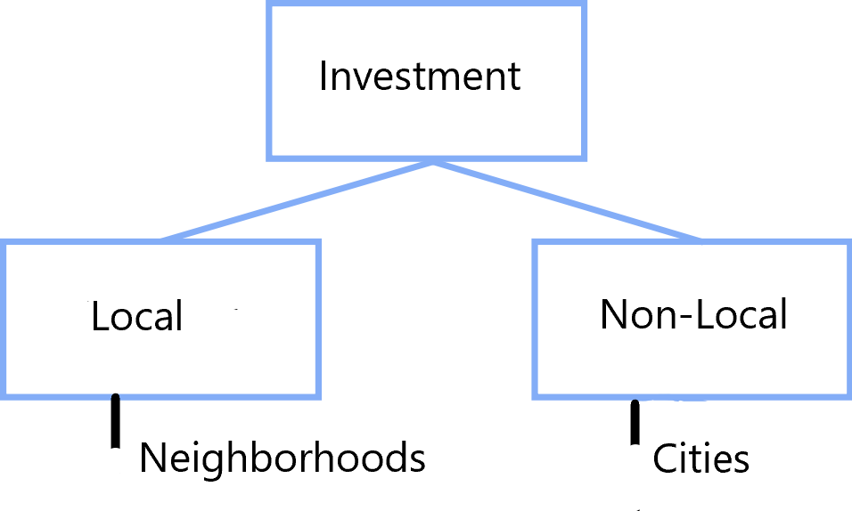

```{r setup, include=FALSE}
knitr::opts_chunk$set(warning=FALSE, message=FALSE, echo = FALSE)
```
```{r}
library(plotly)
load("graphs.Rdata")
load("Maps.Rdata")
```
## Introduction 
- Investors are attracted to cities where there are opportunities to make money
- Quality and affordability of infrastructure and surrounding places
- Investors simply want to go somewhere that feels relevant and vibrant


## Objective
Investigate where the money is coming from to a city, in which areas of the city it is going to and who is going to continue investing in these areas by keeping putting in money for their upkeep

## Datasets

## Dataset 1
- City of Somerville's ISD Building Permit Daily Applications dataset 
    - Parcel ID
    - Address
    - Location (Latitude & Longitude)
    - Applicant Name
    - Applicant's Home Address 
    - Total Permit Fees
    
## Dataset 2
- City of Somerville's FY 2018 Tax Assessor's dataset
    - Property ID
    - Total Value
    - Year Built
    - Style
    - Number of Rooms
    - Stories
    - Area in Acres

## Where the money is coming from, in which areas it is going to ?
    
## Neighborhood Level




##
<p style="font-size: 26px; margin-top: -40px; margin-bottom: 40px;"> Neighborhood Preference of Local Non-Contractors</p>
<div style="margin-left:-65px; margin-top:-65px; margin-bottom:-65px;margin-right:-65px;">
<center>
```{r, fig.height=8, fig.width=8}
graph1
```
</center>
</div>
##
<div style="margin-left:-65px; margin-top:-65px; margin-bottom:-65px;margin-right:-65px;">
<center>
```{r, fig.height=8, fig.width=10}
heatmap1
```
</center>
</div>


##
<p style="font-size: 26px; margin-top: -40px; margin-bottom: 40px;"> Neighborhood Preference of Local Contractors </p>
<div style="margin-left:-65px; margin-top:-65px; margin-bottom:-65px;margin-right:-65px;">
<center>
```{r, fig.height=8, fig.width=8}
graph2
```
</center>
</div>
##
<div style="margin-left:-65px; margin-top:-65px; margin-bottom:-65px;margin-right:-65px;">
<center>
```{r, fig.height=8, fig.width=10}
heatmap2
```
</center>
</div>

##
<p style="font-size: 26px; margin-top: -40px; margin-bottom: 40px;">  Neighborhood Preference of Non-Local Non-Contractors</p>
<div style="margin-left:-65px; margin-top:-65px; margin-bottom:-65px;margin-right:-65px;">
<center>
```{r, fig.height=8, fig.width=8}
graph3
```
</center>
</div>
##
<div style="margin-left:-65px; margin-top:-65px; margin-bottom:-65px;margin-right:-65px;">
<center>
```{r, fig.height=8, fig.width=10}
heatmap3
```
</center>
</div>

##
<p style="font-size: 26px; margin-top: -40px; margin-bottom: 40px;"> Neighborhood Preference of Non-Local Contractors</p>
<div style="margin-left:-65px; margin-top:-65px; margin-bottom:-65px;margin-right:-65px;">
<center>
```{r, fig.height=8, fig.width=8}
graph4
```
</center>
</div>
##
<div style="margin-left:-65px; margin-top:-65px; margin-bottom:-65px;margin-right:-65px;">
<center>
```{r, fig.height=8, fig.width=10}
heatmap4
```
</center>
</div>

## Who is going to continue investing in these areas by keeping putting in money for their upkeep ?

##


## PFS Measure

Summary of PFS measure on Parcel Level

| Minimum | 1st Quartile | Median | Mean   | 3rd Quartile | Maximum |
|---------|--------------|--------|--------|--------------|---------|
| 0.1609  | 0.8401       | 0.9347 | 0.9745 | 1.0632       | 2.9563  |

Summary of PFS measure on Neighborhood Level

| Minimum  | 1st Quartile | Median   | Mean     | 3rd Quartile | Maximum  |
|----------|--------------|----------|----------|--------------|----------|
| 0.005829 | 0.152257     | 0.287699 | 0.638282 | 1.033796     | 3.216514 |

Cut at 3rd quartile

## Results

## Parcel Level
<div style="margin-left:-65px; margin-top:65px; margin-bottom:65px;margin-right:-65px;">
<center>
```{r}
p1
```
</center>
</div>
## ANOVA with post-hoc Tukey HSD Test on Parcel Level

| Investment Type          | diff          | lwr         | upr        | p adj     |
|--------------------------|---------------|-------------|------------|-----------|
| NONLOCAL-DIFFERENT-NBHD  | -0.0097261780 | -0.03342027 | 0.01396791 | 0.6007036 |
| SAME-NBHD-DIFFERENT-NBHD | -0.0009125602 | -0.04132611 | 0.03950099 | 0.9984558 |
| SAME-NBHD-NONLOCAL       | 0.0088136178  | -0.02677428 | 0.04440151 | 0.8304749 |


## Where exactly are these areas?
## {.map}
<p style="font-size: 26px; margin-top: -40px; margin-bottom: 40px;">Hex-binned map of aggregated PFS measure for same neighborhood investment</p>
<iframe width="100%" height="100%" src="maps/PFS_PARCEL_SAME.html" frameborder="0" allowfullscreen></iframe>

## {.map}
<p style="font-size: 26px; margin-top: -40px; margin-bottom: 40px;">Hex-binned map of aggregated PFS measure for different neighborhood investment</p>
<iframe width="100%" height="100%" src="maps/PFS_PARCEL_DIFFERENT.html" frameborder="0" allowfullscreen></iframe>

## {.map}
<p style="font-size: 26px; margin-top: -40px; margin-bottom: 40px;">Hex-binned map of aggregated PFS measure for non-local investment</p>
<iframe width="100%" height="100%" src="maps/PFS_PARCEL_NONLOCAL.html" frameborder="0" allowfullscreen></iframe>

## Neighborhood Level
<div style="margin-left:-65px; margin-top:65px; margin-bottom:65px;margin-right:-65px;">
<center>
```{r}
p2
```
</center>
</div>
## ANOVA with post-hoc Tukey HSD Test on Neighborhood Level

| Investment Type          | diff     | lwr        | upr        | p adj     |
|--------------------------|----------|------------|------------|-----------|
| NONLOCAL-DIFFERENT-NBHD  | 1.13236  | 0.6329547  | 1.6317663  | 0.0000110 |
| SAME-NBHD-DIFFERENT-NBHD | -0.17266 | -0.6832898 | 0.3379699  | 0.6868546 |
| SAME-NBHD-NONLOCAL       | -1.30502 | -1.8156503 | -0.7943906 | 0.0000014 |


## Where exactly are these areas?
## {.map}
<p style="font-size: 26px; margin-top: -40px; margin-bottom: 40px;">PFS measure map ranked by neighborhood for same neighborhood investment</p>
<iframe width="100%" height="100%" src="maps/PFS_NBHD_SAME.html" frameborder="0" allowfullscreen></iframe>

## {.map}
<p style="font-size: 26px; margin-top: -40px; margin-bottom: 40px;">PFS measure map ranked by neighborhood for different neighborhood investment</p>
<iframe width="100%" height="100%" src="maps/PFS_NBHD_DIFFERENT.html" frameborder="0" allowfullscreen></iframe>

## {.map}
<p style="font-size: 26px; margin-top: -40px; margin-bottom: 40px;">PFS measure map ranked by neighborhood for non-local investment</p>
<iframe width="100%" height="100%" src="maps/PFS_NBHD_NONLOCAL.html" frameborder="0" allowfullscreen></iframe>

## Implications for research and policy
- PFS measure can definitely be optimized by incorporating financial information about the property owners themselves
- Analysis can be repeated for any city to locate well-kept areas within it and identify who is investinging them
- These trends can be then studied by city officials to make better decisions on how to attract investors to a city

## Thanks

Anant Jain: jain.anan@husky.neu.edu

